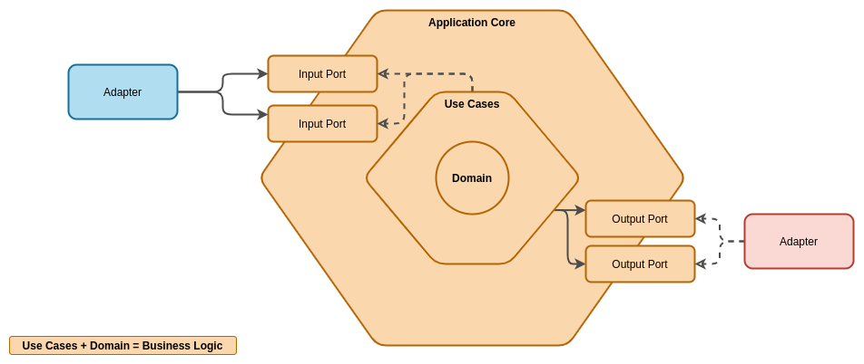
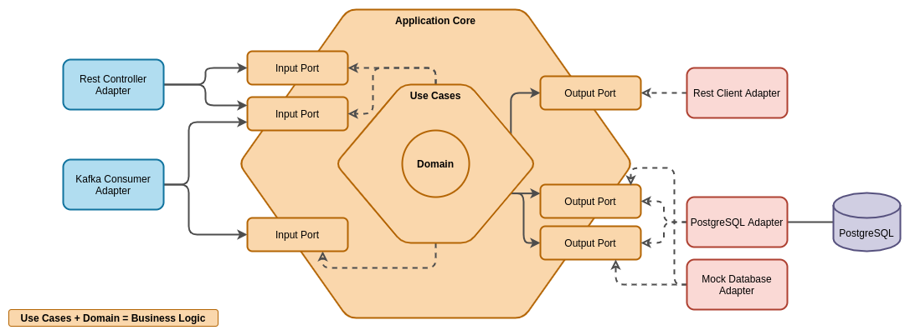
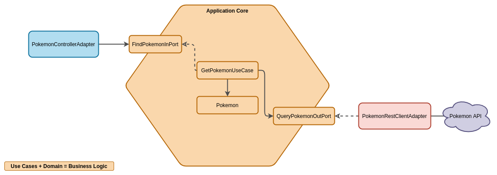

# Monolithic Springboot Kotlin Seed
Semilla de aplicación monolitica springboot 3.1.5-RELEASE con kotlin 1.8.22
Esta aplicación base mnonolitica cuenta con servicios de 
* Autenticación con keycloak
* Gestión de usuarios (Alta Baja y modificación)
* Gestión básica de roles y permisos
* Gestión de productos (Alta Baja y modificación)
* Gestión de pedidos (carrito de compras)
* interfaz para gateway de pagos (MercadoPago)

## Configuración local
1. Instalá la JDK 17 (`sdk install 11.0.8.hs-adpt`)
2. Cloná el repo (`https://github.com/ememosconi/seedmonolitic.git`)
3. Abrí el repo con tu IDE favorito
4. Configurá el perfil **local** como **active profile**
5. Configurá las siguientes propiedades
    * sp.firebase.mocked: true

## Perfiles disponibles
* **local**: Para desarrollo local  y ejecucion de tests
* **test**: Para pruebas en ambiente de test (no para ejecutar tests)
* **prod**: Ambiente productivo

## Autenticación

### Usuario mockeado
Si levantas la app con firebase mockeado (`sp.firebase.mocked: true`), se va a usar un usuario mockeado.  
Actualmente hay 3 posibles usuarios para elegir, Julieta (un cliente), Nick (un profesional) y Damian (un admin de sp).  
Para elegir un usuario tenes que mandar su nombre como bearer token ("julieta", "nick" o "damian"). Si mandas fruta se va a usar el usuario de nick por defecto.

#### Nick
```json
{
    "id": "ed42e216-5951-4785-a216-ede3d32662c9",
    "firebaseId": "69ziRJTjaXfzpWpMMa6bYmtYp1y2",
    "name": "Nick Riviera",
    "picture": "/profiles/nick.jpg",
    "email": "nick@riviera.com",
    "isEmailVerified": true,
    "roles": "ROLE_VENDOR_USER"
}
```

#### Julieta
```json
{
    "id": "9ed8c510-7a52-4ab1-9aee-416534845519",
    "firebaseId": "97TY3AAo5dc4bjEBaRa6MCf0tI22",
    "name": "Julieta Venegas",
    "picture": "/profiles/julieta.jpg",
    "email": "julieta@venegas.com",
    "isEmailVerified": true,
    "roles": "ROLE_CLIENT_USER"
}
```

#### Damian
```json
{
    "id": "000904bc-4b34-4131-8dbd-d2106f0446e6",
    "firebaseId": "5AyrrsAtXBS6JJo3ZCe1g7OFMAN2",
    "name": "Damian Admin",
    "picture": "/profiles/damian.jpg",
    "email": "adminsaludprevent@redb.ee",
    "isEmailVerified": true,
    "roles": "ROLE_SP_ADMIN"
}
```

### JWT
Si levantas la app sin firebase mockeado, tenes que mandar el header `Authorization: Bearer <token>`.
Para obtener un token a partir de un usuario existente podes ejecutar el siguiente script reemplazando la key el usuario y la password con información real.

El usuario de *Nick* en firebase tiene user **nick@riviera.com** y password **nick1234**.

```shell script
curl 'https://identitytoolkit.googleapis.com/v1/accounts:signInWithPassword?key=<project_key>' \ -H 'Content-Type: application/json' \ --data-binary '{"email":"<user_email>","password":"<user_password>","returnSecureToken":true}'  
```

## Pruebas
Para correrlos podes ejecutar `gradle test` parado sobre el directorio del proyecto, teniendo configurado el **ambiente local**.

## Estructura
Para este proyecto se está usando una interpretación de la arquitectura Hexagonal en base a dominios, esto quiere decir de que en cada dominio de negocio hay una distribución como arquitectura hexagonal. El enfoque que decidimos tomar de arquitectura hexagonal  es bastante similar a lo que se plantea en [este articulo](https://reflectoring.io/spring-hexagonal/)

Este tipo de estructuras divididas por dominios de negocio nos permite tener una mejor escalabilidad y mantenibilidad del código, ya que cada dominio de negocio es independiente de los demás y se puede escalar de forma independiente, y si el dia de mañana queremos separar esta estructura monolítica en micro servicios, simplemente nos llevamos el codigo del dominio que representa el micro servicio y lo dejamos en un nuevo servicio. 

### Concepto



### Ejemplo



### Ejemplo Semilla



## Packages
```text
motors
├── <domain_name>: aqui va toda la aruitecura hexagonal de un dominio de negocio por ejemplo "users"
    ├── adapter: Aquí se especifican los distintos adapters de la aplicación
    │   └── <adapter_name>
    │       ├── exception: Aqui van las excepciones que el adapter puede interpretar
    │       └── model: Aqui van las clases que representan request/responses del adapter.
    ├── application
    │   ├── port
    │   │   ├── in: Aqui van las interfaces que representan puertos de entrada a los casos de uso
    │   │   └── out: Aqui van las interfaces que representan puertos de salida de los casos de uso
    │   └── usecase: Aqui van las clases que representan los casos de uso
    ├── config
    │   ├── exception: Aqui van las excepciones de dominio del servicio
    │   ├── properties: Aqui van las clases que representan propiedades del servicio
    ├── domain: Aqui van los dominios de tu servicio
    └── extensions: Aqui van los utils que creas necesario para tu código
```

## Swagger
* OpenApi json: http://localhost:9000/v3/api-docs
* Swagger-ui: http://localhost:9000/swagger-ui/
* [Documentacion de Springfox](https://springfox.github.io/springfox/docs/current/)

## Doc de referencia de Spring
[HELP](docs/HELP.md)
